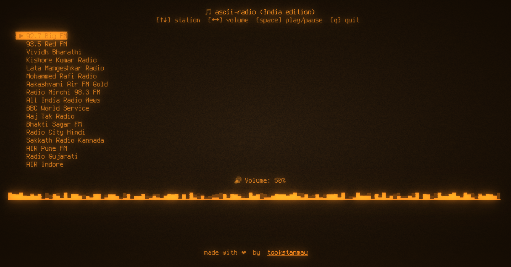
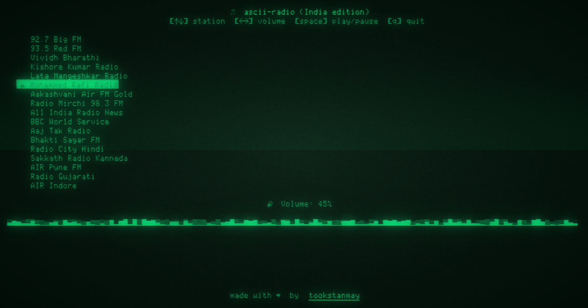
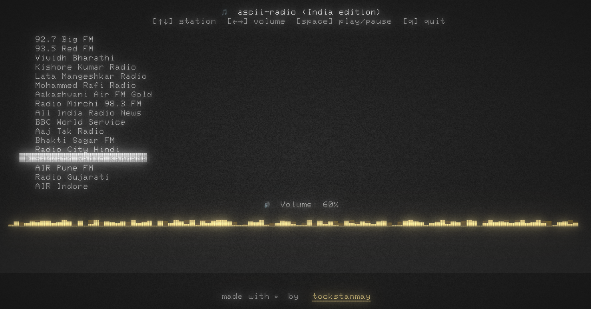
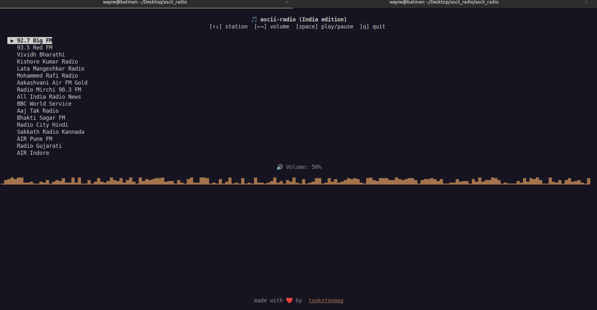
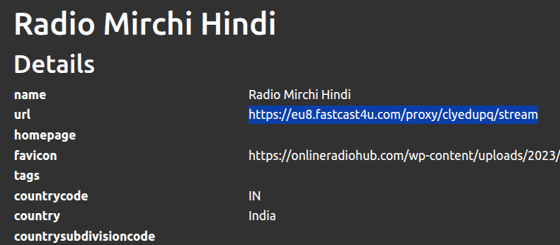
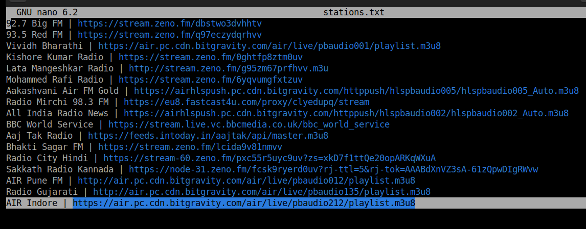

# ascii-radio

A terminal-based radio streaming player built with Python.

### Features
- Keyboard-controlled station switching ⬆️ & ⬇️
- Volume control using left and right cursor keys ⬅️ & ➡️
- Select from list of stations available
- ▶️ play/ ⏸️ pause using spacebar

<br>

### Screenshots of ASCII_RADIO






<br>

### Installation
If you directly want to use the tool, just run following command
```
pip install git+https://github.com/tookstanmay/ascii_radio.git
```
after installation, type this
```
ascii-radio
```

To uninstall this tool, run following
```
pip uninstall ascii-radio
```

### Customizations

To clone the repo follow these steps,
```bash
git clone https://github.com/tookstanmay/ascii_radio
cd ascii_radio
pip install .
ascii-radio
```

If you're a crazy dev like me and want to customize the stations, take a peek into ```stations.txt``` file. You'll need a streaming URL for the station you want to see in the tool.
1. To get the streaming URL go to [radio-browser](https://www.radio-browser.info/)
2. From the top menu bar, filter by the option you like and select the radio station which comes in the result
3. Headover to url as shown in the image and copy it
4. append it into ```stations.txt``` in following manner<br>
   ```Radio Mirchi FM | https://eu8.fastcast4u.com/proxy/clyedupq/stream```
5. Run the run.py file using ```python3 run.py```
6. To remove the package, run this command from parent directory where tool was installed, ```rm -fr ascii_radio```




<br>
<br>

**Pro tip:** If you also want your terminal to look like the ones here, install ```cool-retro-term```, it's available as ```snap``` package for Ubuntu.   
